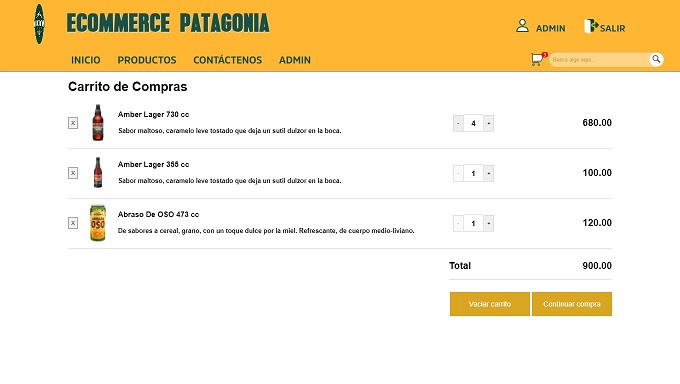
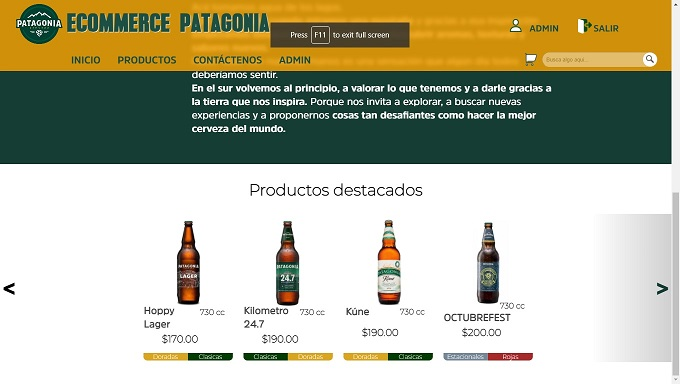
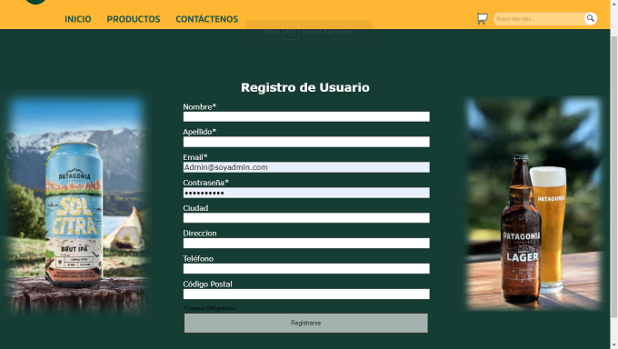
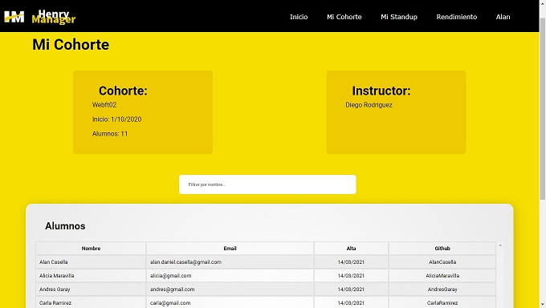
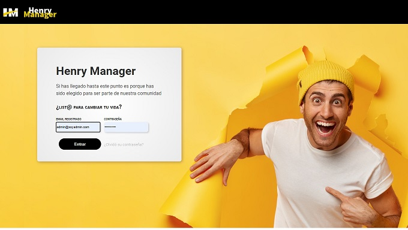
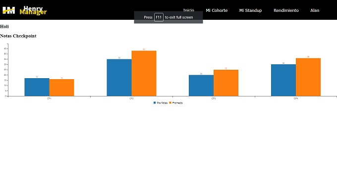
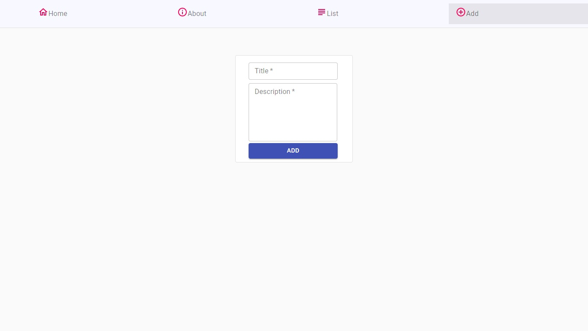
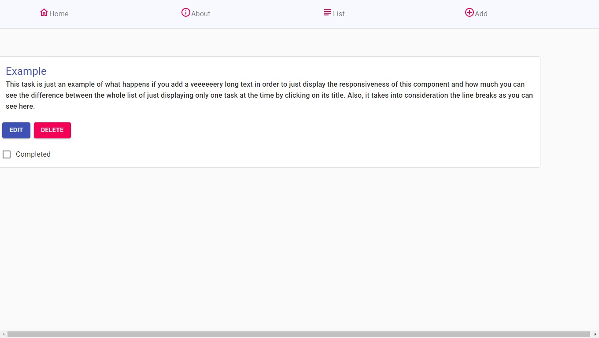
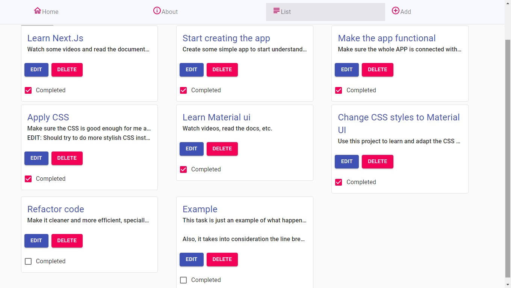

# Hi there, I'm Alan

## I'm a FullStack web developer

#### You can check my previous work at my [portfolio](https://portfolio-alancasella.vercel.app/)

## Checkout my work 👇 or visit the repos

____________________
## E-commerce 

[Visit](https://ecommerce-patagonia.vercel.app/)

🏷️ developed to sale beer from known brand in Argentina 

💻 Technologies: 
React -Redux - Sequelize - NodeJs - Express - Passport - Mailgun - JsonWebToken - Multer

____________

## HENRY APP 

🏷️ Developed with the aim of having better feedback of Henry´s bootcamp as a student

💻 Technologies: 
Typescript - React - Redux - NodeJs - Express - Bcrypt - JsonWebToken - Xlxs - C3Js

____________

## Todo-App
[Visit](https://todo-tasks.vercel.app/)

🏷️ Developed as part of an interview with a limited time frame

💻 Technologies: 
Next.JS - Material UI - Axios - MongoDB - Mongoose - SweetAlert 2

 
 
 
 
 
 
 
 
 
 
 
 
 
 
 
 
 
 
 
 

____________

## 📫 CONTACT ME

Have a question or want to work together? 

**Email:** alan.daniel.casella@gmail.com

<!--
**AlanCasella/AlanCasella** is a ✨ _special_ ✨ repository because its `README.md` (this file) appears on your GitHub profile.

Here are some ideas to get you started:

- 🔭 I’m currently working on ...
- 🌱 I’m currently learning ...
- 👯 I’m looking to collaborate on ...
- 🤔 I’m looking for help with ...
- 💬 Ask me about ...
- 📫 How to reach me: ...
- 😄 Pronouns: ...
- ⚡ Fun fact: ...
-->
